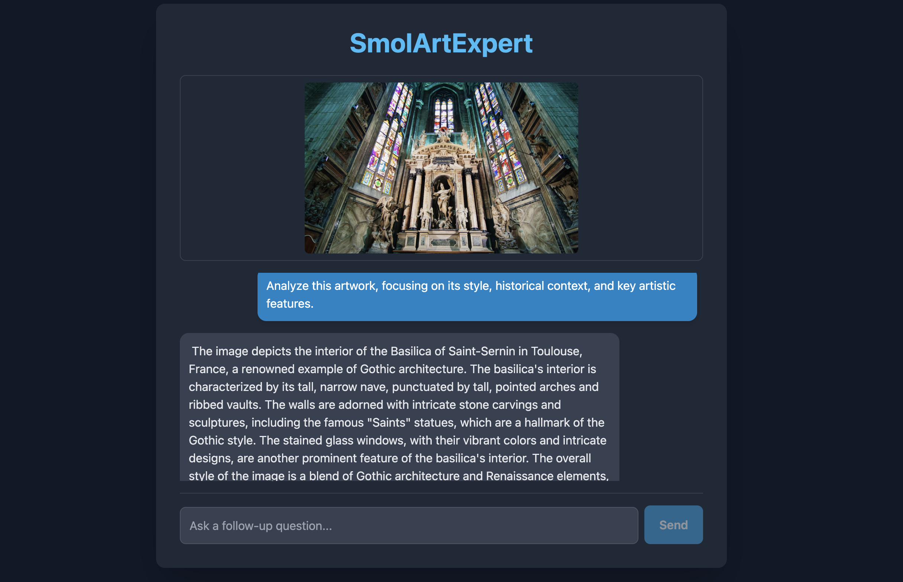

# SmolVLM2 MLX Demo

## Overview

This repository contains a demonstration of SmolVLM2, a vision-language model running on Apple Silicon using MLX. The model can analyze images and respond to text prompts about the visual content.

## Features

- Image analysis and description
- Interactive chat with visual context
- Optimized for Apple Silicon with MLX framework
- Web-based interface for easy interaction

## Getting Started

1. Clone this repository
2. Install dependencies: `pip install -r requirements.txt`
3. Run the API server: `python api.py`
4. Open the web interface in your browser

## Model Information

This demo uses the SmolVLM2-2.2B-Instruct model converted to MLX format for efficient inference on Apple Silicon devices.
